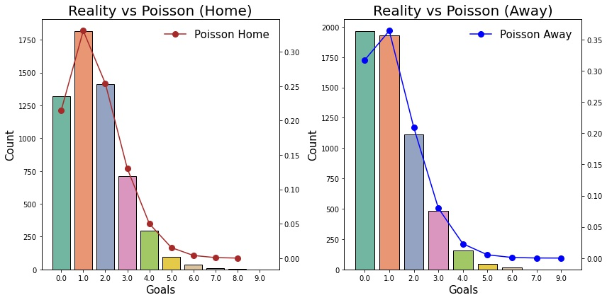
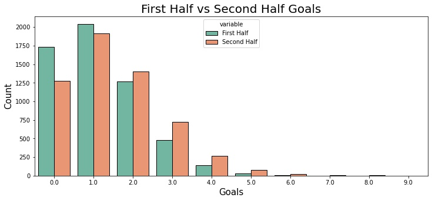

This project attempts to determine whether goal scoring in the premier league can be modelled by a poisson process. A simple Poisson model is a good starting point to model the number of goals scored in a match in a 90-min game. Later, we will use this to simulate an entire season using on the data from 2005-2020 seasons. 

The data for this project is scraped from [football-data.co.uk](https://www.football-data.co.uk) which contains information for each game since 1993/94 season.

### [[Show me the Code]](https://github.com/vedantthapa/Predict-EPL-Standings)

---

Here is a snapshot of the data

```python
epl.tail(3)
```

<div class="table-wrapper" markdown="block">
<style scoped>
    .dataframe tbody tr th:only-of-type {
        vertical-align: middle;
    }

    .dataframe tbody tr th {
        vertical-align: top;
    }

    .dataframe thead th {
        text-align: right;
    }
</style>
<table border="1" class="dataframe">
  <thead>
    <tr style="text-align: right;">
      <th></th>
      <th>Div</th>
      <th>season</th>
      <th>Date</th>
      <th>HomeTeam</th>
      <th>AwayTeam</th>
      <th>FTHG</th>
      <th>FTAG</th>
      <th>FTR</th>
      <th>HTHG</th>
      <th>HTAG</th>
      <th>...</th>
      <th>AvgC&lt;2.5</th>
      <th>AHCh</th>
      <th>B365CAHH</th>
      <th>B365CAHA</th>
      <th>PCAHH</th>
      <th>PCAHA</th>
      <th>MaxCAHH</th>
      <th>MaxCAHA</th>
      <th>AvgCAHH</th>
      <th>AvgCAHA</th>
    </tr>
  </thead>
  <tbody>
    <tr>
      <th>5698</th>
      <td>E0</td>
      <td>1920</td>
      <td>26/07/2020</td>
      <td>Newcastle</td>
      <td>Liverpool</td>
      <td>1.0</td>
      <td>3.0</td>
      <td>A</td>
      <td>1.0</td>
      <td>1.0</td>
      <td>...</td>
      <td>2.40</td>
      <td>1.0</td>
      <td>1.94</td>
      <td>1.96</td>
      <td>1.95</td>
      <td>1.97</td>
      <td>2.03</td>
      <td>2.00</td>
      <td>1.95</td>
      <td>1.92</td>
    </tr>
    <tr>
      <th>5699</th>
      <td>E0</td>
      <td>1920</td>
      <td>26/07/2020</td>
      <td>Southampton</td>
      <td>Sheffield United</td>
      <td>3.0</td>
      <td>1.0</td>
      <td>H</td>
      <td>0.0</td>
      <td>1.0</td>
      <td>...</td>
      <td>2.01</td>
      <td>-0.5</td>
      <td>1.97</td>
      <td>1.93</td>
      <td>2.00</td>
      <td>1.93</td>
      <td>2.03</td>
      <td>1.96</td>
      <td>1.98</td>
      <td>1.89</td>
    </tr>
    <tr>
      <th>5700</th>
      <td>E0</td>
      <td>1920</td>
      <td>26/07/2020</td>
      <td>West Ham</td>
      <td>Aston Villa</td>
      <td>1.0</td>
      <td>1.0</td>
      <td>D</td>
      <td>0.0</td>
      <td>0.0</td>
      <td>...</td>
      <td>2.03</td>
      <td>0.0</td>
      <td>1.93</td>
      <td>1.97</td>
      <td>1.95</td>
      <td>1.98</td>
      <td>1.99</td>
      <td>2.00</td>
      <td>1.93</td>
      <td>1.95</td>
    </tr>
  </tbody>
</table>
<p>3 rows × 140 columns</p>
</div>

For this project we only need 5 columns starting from the `Date` field. Therefore, let's get rid of the unwanted columns and rename them so that is is easier to index these columns.


```python
# removing unncessary cols
epl = epl.iloc[:, 1:7]
```


```python
# rename cols
epl.columns = [i.lower() for i in epl]
epl.rename(columns={'fthg':'homegoals', 'ftag':'awaygoals'}, inplace=True)
```

Let's have a look at the average number of home and away goals scored in each game.


```python
# avg home vs away goals
epl.mean()[1:]
```

    homegoals    1.537544
    awaygoals    1.147544
    dtype: float64


Well, this result should be intuitive to anyone who follows sports like Soccer, American football, Basketball, etc. as the team which plays at home is considered to have an advantage mainly due to the players familiarity and comfort with the environment and their fan's presence. 

Let's try to compare the actual number goals scored in a game to the goals calculated by the poisson process.
    

    
The poisson model fits the distribution very well, as shown in the figures above. Hopefully, we'll be able to adapt this method to simulate individual matches throughout the course of a season.

We will now create poisson regression models and get the regression coefficients as each team's home and away scoring rates. Since, by default, statsmodels uses the team that comes first alphabetically as the reference group, we will replace the y-intercept term with 0. 


```python
home = smf.glm(formula="homegoals ~ 0 + hometeam", data=epl, 
                        family=sm.families.Poisson()).fit()
home.summary()
```


<table class="simpletable">
<caption>Generalized Linear Model Regression Results</caption>
<tr>
  <th>Dep. Variable:</th>       <td>homegoals</td>    <th>  No. Observations:  </th>  <td>  5700</td> 
</tr>
<tr>
  <th>Model:</th>                  <td>GLM</td>       <th>  Df Residuals:      </th>  <td>  5661</td> 
</tr>
<tr>
  <th>Model Family:</th>         <td>Poisson</td>     <th>  Df Model:          </th>  <td>    38</td> 
</tr>
<tr>
  <th>Link Function:</th>          <td>log</td>       <th>  Scale:             </th> <td>  1.0000</td>
</tr>
<tr>
  <th>Method:</th>                <td>IRLS</td>       <th>  Log-Likelihood:    </th> <td> -8746.5</td>
</tr>
<tr>
  <th>Date:</th>            <td>Thu, 25 Nov 2021</td> <th>  Deviance:          </th> <td>  6561.9</td>
</tr>
<tr>
  <th>Time:</th>                <td>10:39:35</td>     <th>  Pearson chi2:      </th> <td>5.72e+03</td>
</tr>
<tr>
  <th>No. Iterations:</th>          <td>5</td>        <th>  Pseudo R-squ. (CS):</th>  <td>0.09657</td>
</tr>
<tr>
  <th>Covariance Type:</th>     <td>nonrobust</td>    <th>                     </th>     <td> </td>   
</tr>
</table>
<table class="simpletable">
<tr>
               <td></td>                 <th>coef</th>     <th>std err</th>      <th>z</th>      <th>P>|z|</th>  <th>[0.025</th>    <th>0.975]</th>  
</tr>
<tr>
  <th>hometeam[Arsenal]</th>          <td>    0.7527</td> <td>    0.041</td> <td>   18.515</td> <td> 0.000</td> <td>    0.673</td> <td>    0.832</td>
</tr>
<tr>
  <th>hometeam[Aston Villa]</th>      <td>    0.1874</td> <td>    0.060</td> <td>    3.108</td> <td> 0.002</td> <td>    0.069</td> <td>    0.306</td>
</tr>
<tr>
  <th>hometeam[Birmingham]</th>       <td>    0.1352</td> <td>    0.107</td> <td>    1.261</td> <td> 0.207</td> <td>   -0.075</td> <td>    0.345</td>
</tr>
<tr>
  <th>hometeam[Blackburn]</th>        <td>    0.3354</td> <td>    0.073</td> <td>    4.574</td> <td> 0.000</td> <td>    0.192</td> <td>    0.479</td>
</tr>
<tr>
  <th>hometeam[Blackpool]</th>        <td>    0.4568</td> <td>    0.183</td> <td>    2.502</td> <td> 0.012</td> <td>    0.099</td> <td>    0.815</td>
</tr>
<tr>
  <th>hometeam[Bolton]</th>           <td>    0.3137</td> <td>    0.074</td> <td>    4.231</td> <td> 0.000</td> <td>    0.168</td> <td>    0.459</td>
</tr>
<tr>
  <th>hometeam[Bournemouth]</th>      <td>    0.3588</td> <td>    0.086</td> <td>    4.184</td> <td> 0.000</td> <td>    0.191</td> <td>    0.527</td>
</tr>
<tr>
  <th>hometeam[Brighton]</th>         <td>    0.1001</td> <td>    0.126</td> <td>    0.794</td> <td> 0.427</td> <td>   -0.147</td> <td>    0.347</td>
</tr>
<tr>
  <th>hometeam[Burnley]</th>          <td>    0.1236</td> <td>    0.088</td> <td>    1.404</td> <td> 0.160</td> <td>   -0.049</td> <td>    0.296</td>
</tr>
<tr>
  <th>hometeam[Cardiff]</th>          <td>    0.0760</td> <td>    0.156</td> <td>    0.487</td> <td> 0.627</td> <td>   -0.230</td> <td>    0.382</td>
</tr>
<tr>
  <th>hometeam[Charlton]</th>         <td>    0.0760</td> <td>    0.156</td> <td>    0.487</td> <td> 0.627</td> <td>   -0.230</td> <td>    0.382</td>
</tr>
<tr>
  <th>hometeam[Chelsea]</th>          <td>    0.7560</td> <td>    0.041</td> <td>   18.627</td> <td> 0.000</td> <td>    0.676</td> <td>    0.836</td>
</tr>
<tr>
  <th>hometeam[Crystal Palace]</th>   <td>    0.0864</td> <td>    0.083</td> <td>    1.040</td> <td> 0.298</td> <td>   -0.076</td> <td>    0.249</td>
</tr>
<tr>
  <th>hometeam[Derby]</th>            <td>   -0.4595</td> <td>    0.289</td> <td>   -1.592</td> <td> 0.111</td> <td>   -1.025</td> <td>    0.106</td>
</tr>
<tr>
  <th>hometeam[Everton]</th>          <td>    0.5024</td> <td>    0.046</td> <td>   10.903</td> <td> 0.000</td> <td>    0.412</td> <td>    0.593</td>
</tr>
<tr>
  <th>hometeam[Fulham]</th>           <td>    0.3365</td> <td>    0.061</td> <td>    5.488</td> <td> 0.000</td> <td>    0.216</td> <td>    0.457</td>
</tr>
<tr>
  <th>hometeam[Huddersfield]</th>     <td>   -0.3795</td> <td>    0.196</td> <td>   -1.935</td> <td> 0.053</td> <td>   -0.764</td> <td>    0.005</td>
</tr>
<tr>
  <th>hometeam[Hull]</th>             <td>    0.1190</td> <td>    0.097</td> <td>    1.230</td> <td> 0.219</td> <td>   -0.071</td> <td>    0.308</td>
</tr>
<tr>
  <th>hometeam[Leicester]</th>        <td>    0.4456</td> <td>    0.075</td> <td>    5.945</td> <td> 0.000</td> <td>    0.299</td> <td>    0.592</td>
</tr>
<tr>
  <th>hometeam[Liverpool]</th>        <td>    0.7527</td> <td>    0.041</td> <td>   18.515</td> <td> 0.000</td> <td>    0.673</td> <td>    0.832</td>
</tr>
<tr>
  <th>hometeam[Man City]</th>         <td>    0.8105</td> <td>    0.039</td> <td>   20.521</td> <td> 0.000</td> <td>    0.733</td> <td>    0.888</td>
</tr>
<tr>
  <th>hometeam[Man United]</th>       <td>    0.7527</td> <td>    0.041</td> <td>   18.515</td> <td> 0.000</td> <td>    0.673</td> <td>    0.832</td>
</tr>
<tr>
  <th>hometeam[Middlesbrough]</th>    <td>    0.2336</td> <td>    0.091</td> <td>    2.559</td> <td> 0.010</td> <td>    0.055</td> <td>    0.413</td>
</tr>
<tr>
  <th>hometeam[Newcastle]</th>        <td>    0.3196</td> <td>    0.054</td> <td>    5.892</td> <td> 0.000</td> <td>    0.213</td> <td>    0.426</td>
</tr>
<tr>
  <th>hometeam[Norwich]</th>          <td>    0.1911</td> <td>    0.093</td> <td>    2.049</td> <td> 0.040</td> <td>    0.008</td> <td>    0.374</td>
</tr>
<tr>
  <th>hometeam[Portsmouth]</th>       <td>    0.2252</td> <td>    0.092</td> <td>    2.457</td> <td> 0.014</td> <td>    0.046</td> <td>    0.405</td>
</tr>
<tr>
  <th>hometeam[QPR]</th>              <td>    0.0513</td> <td>    0.129</td> <td>    0.397</td> <td> 0.691</td> <td>   -0.202</td> <td>    0.304</td>
</tr>
<tr>
  <th>hometeam[Reading]</th>          <td>    0.2196</td> <td>    0.119</td> <td>    1.851</td> <td> 0.064</td> <td>   -0.013</td> <td>    0.452</td>
</tr>
<tr>
  <th>hometeam[Sheffield United]</th> <td>    0.2336</td> <td>    0.144</td> <td>    1.619</td> <td> 0.106</td> <td>   -0.049</td> <td>    0.517</td>
</tr>
<tr>
  <th>hometeam[Southampton]</th>      <td>    0.3652</td> <td>    0.068</td> <td>    5.404</td> <td> 0.000</td> <td>    0.233</td> <td>    0.498</td>
</tr>
<tr>
  <th>hometeam[Stoke]</th>            <td>    0.2664</td> <td>    0.064</td> <td>    4.195</td> <td> 0.000</td> <td>    0.142</td> <td>    0.391</td>
</tr>
<tr>
  <th>hometeam[Sunderland]</th>       <td>    0.1173</td> <td>    0.065</td> <td>    1.797</td> <td> 0.072</td> <td>   -0.011</td> <td>    0.245</td>
</tr>
<tr>
  <th>hometeam[Swansea]</th>          <td>    0.2970</td> <td>    0.075</td> <td>    3.974</td> <td> 0.000</td> <td>    0.151</td> <td>    0.444</td>
</tr>
<tr>
  <th>hometeam[Tottenham]</th>        <td>    0.6071</td> <td>    0.044</td> <td>   13.884</td> <td> 0.000</td> <td>    0.521</td> <td>    0.693</td>
</tr>
<tr>
  <th>hometeam[Watford]</th>          <td>    0.1983</td> <td>    0.085</td> <td>    2.338</td> <td> 0.019</td> <td>    0.032</td> <td>    0.365</td>
</tr>
<tr>
  <th>hometeam[West Brom]</th>        <td>    0.2583</td> <td>    0.064</td> <td>    4.051</td> <td> 0.000</td> <td>    0.133</td> <td>    0.383</td>
</tr>
<tr>
  <th>hometeam[West Ham]</th>         <td>    0.3514</td> <td>    0.051</td> <td>    6.832</td> <td> 0.000</td> <td>    0.251</td> <td>    0.452</td>
</tr>
<tr>
  <th>hometeam[Wigan]</th>            <td>    0.1060</td> <td>    0.077</td> <td>    1.378</td> <td> 0.168</td> <td>   -0.045</td> <td>    0.257</td>
</tr>
<tr>
  <th>hometeam[Wolves]</th>           <td>    0.2083</td> <td>    0.092</td> <td>    2.253</td> <td> 0.024</td> <td>    0.027</td> <td>    0.389</td>
</tr>
</table>


Similarly for away goals


```python
away = smf.glm(formula="awaygoals ~ 0 + awayteam", data=epl, 
                        family=sm.families.Poisson()).fit()
away.summary()
```


<table class="simpletable">
<caption>Generalized Linear Model Regression Results</caption>
<tr>
  <th>Dep. Variable:</th>       <td>awaygoals</td>    <th>  No. Observations:  </th>  <td>  5700</td> 
</tr>
<tr>
  <th>Model:</th>                  <td>GLM</td>       <th>  Df Residuals:      </th>  <td>  5661</td> 
</tr>
<tr>
  <th>Model Family:</th>         <td>Poisson</td>     <th>  Df Model:          </th>  <td>    38</td> 
</tr>
<tr>
  <th>Link Function:</th>          <td>log</td>       <th>  Scale:             </th> <td>  1.0000</td>
</tr>
<tr>
  <th>Method:</th>                <td>IRLS</td>       <th>  Log-Likelihood:    </th> <td> -7854.0</td>
</tr>
<tr>
  <th>Date:</th>            <td>Thu, 25 Nov 2021</td> <th>  Deviance:          </th> <td>  6783.8</td>
</tr>
<tr>
  <th>Time:</th>                <td>10:39:35</td>     <th>  Pearson chi2:      </th> <td>5.94e+03</td>
</tr>
<tr>
  <th>No. Iterations:</th>          <td>5</td>        <th>  Pseudo R-squ. (CS):</th>  <td>0.08115</td>
</tr>
<tr>
  <th>Covariance Type:</th>     <td>nonrobust</td>    <th>                     </th>     <td> </td>   
</tr>
</table>
<table class="simpletable">
<tr>
               <td></td>                 <th>coef</th>     <th>std err</th>      <th>z</th>      <th>P>|z|</th>  <th>[0.025</th>    <th>0.975]</th>  
</tr>
<tr>
  <th>awayteam[Arsenal]</th>          <td>    0.4634</td> <td>    0.047</td> <td>    9.863</td> <td> 0.000</td> <td>    0.371</td> <td>    0.555</td>
</tr>
<tr>
  <th>awayteam[Aston Villa]</th>      <td>    0.1197</td> <td>    0.062</td> <td>    1.919</td> <td> 0.055</td> <td>   -0.003</td> <td>    0.242</td>
</tr>
<tr>
  <th>awayteam[Birmingham]</th>       <td>   -0.2036</td> <td>    0.127</td> <td>   -1.603</td> <td> 0.109</td> <td>   -0.453</td> <td>    0.045</td>
</tr>
<tr>
  <th>awayteam[Blackburn]</th>        <td>    0.0655</td> <td>    0.084</td> <td>    0.780</td> <td> 0.435</td> <td>   -0.099</td> <td>    0.230</td>
</tr>
<tr>
  <th>awayteam[Blackpool]</th>        <td>    0.2744</td> <td>    0.200</td> <td>    1.372</td> <td> 0.170</td> <td>   -0.118</td> <td>    0.666</td>
</tr>
<tr>
  <th>awayteam[Bolton]</th>           <td>   -0.0152</td> <td>    0.087</td> <td>   -0.173</td> <td> 0.862</td> <td>   -0.186</td> <td>    0.156</td>
</tr>
<tr>
  <th>awayteam[Bournemouth]</th>      <td>    0.1001</td> <td>    0.098</td> <td>    1.026</td> <td> 0.305</td> <td>   -0.091</td> <td>    0.291</td>
</tr>
<tr>
  <th>awayteam[Brighton]</th>         <td>   -0.2364</td> <td>    0.149</td> <td>   -1.586</td> <td> 0.113</td> <td>   -0.529</td> <td>    0.056</td>
</tr>
<tr>
  <th>awayteam[Burnley]</th>          <td>   -0.0918</td> <td>    0.098</td> <td>   -0.936</td> <td> 0.349</td> <td>   -0.284</td> <td>    0.100</td>
</tr>
<tr>
  <th>awayteam[Cardiff]</th>          <td>   -0.4187</td> <td>    0.200</td> <td>   -2.094</td> <td> 0.036</td> <td>   -0.811</td> <td>   -0.027</td>
</tr>
<tr>
  <th>awayteam[Charlton]</th>         <td>   -0.1112</td> <td>    0.171</td> <td>   -0.649</td> <td> 0.517</td> <td>   -0.447</td> <td>    0.225</td>
</tr>
<tr>
  <th>awayteam[Chelsea]</th>          <td>    0.4700</td> <td>    0.047</td> <td>   10.037</td> <td> 0.000</td> <td>    0.378</td> <td>    0.562</td>
</tr>
<tr>
  <th>awayteam[Crystal Palace]</th>   <td>    0.1269</td> <td>    0.081</td> <td>    1.560</td> <td> 0.119</td> <td>   -0.033</td> <td>    0.286</td>
</tr>
<tr>
  <th>awayteam[Derby]</th>            <td>   -0.8650</td> <td>    0.354</td> <td>   -2.447</td> <td> 0.014</td> <td>   -1.558</td> <td>   -0.172</td>
</tr>
<tr>
  <th>awayteam[Everton]</th>          <td>    0.0937</td> <td>    0.057</td> <td>    1.658</td> <td> 0.097</td> <td>   -0.017</td> <td>    0.204</td>
</tr>
<tr>
  <th>awayteam[Fulham]</th>           <td>   -0.1908</td> <td>    0.080</td> <td>   -2.390</td> <td> 0.017</td> <td>   -0.347</td> <td>   -0.034</td>
</tr>
<tr>
  <th>awayteam[Huddersfield]</th>     <td>   -0.4595</td> <td>    0.204</td> <td>   -2.251</td> <td> 0.024</td> <td>   -0.860</td> <td>   -0.059</td>
</tr>
<tr>
  <th>awayteam[Hull]</th>             <td>   -0.2498</td> <td>    0.116</td> <td>   -2.149</td> <td> 0.032</td> <td>   -0.478</td> <td>   -0.022</td>
</tr>
<tr>
  <th>awayteam[Leicester]</th>        <td>    0.3264</td> <td>    0.080</td> <td>    4.103</td> <td> 0.000</td> <td>    0.170</td> <td>    0.482</td>
</tr>
<tr>
  <th>awayteam[Liverpool]</th>        <td>    0.4411</td> <td>    0.048</td> <td>    9.284</td> <td> 0.000</td> <td>    0.348</td> <td>    0.534</td>
</tr>
<tr>
  <th>awayteam[Man City]</th>         <td>    0.4895</td> <td>    0.046</td> <td>   10.557</td> <td> 0.000</td> <td>    0.399</td> <td>    0.580</td>
</tr>
<tr>
  <th>awayteam[Man United]</th>       <td>    0.4895</td> <td>    0.046</td> <td>   10.557</td> <td> 0.000</td> <td>    0.399</td> <td>    0.580</td>
</tr>
<tr>
  <th>awayteam[Middlesbrough]</th>    <td>   -0.3054</td> <td>    0.120</td> <td>   -2.555</td> <td> 0.011</td> <td>   -0.540</td> <td>   -0.071</td>
</tr>
<tr>
  <th>awayteam[Newcastle]</th>        <td>   -0.0583</td> <td>    0.066</td> <td>   -0.891</td> <td> 0.373</td> <td>   -0.187</td> <td>    0.070</td>
</tr>
<tr>
  <th>awayteam[Norwich]</th>          <td>   -0.2912</td> <td>    0.119</td> <td>   -2.454</td> <td> 0.014</td> <td>   -0.524</td> <td>   -0.059</td>
</tr>
<tr>
  <th>awayteam[Portsmouth]</th>       <td>   -0.1350</td> <td>    0.110</td> <td>   -1.230</td> <td> 0.219</td> <td>   -0.350</td> <td>    0.080</td>
</tr>
<tr>
  <th>awayteam[QPR]</th>              <td>   -0.0357</td> <td>    0.135</td> <td>   -0.265</td> <td> 0.791</td> <td>   -0.300</td> <td>    0.229</td>
</tr>
<tr>
  <th>awayteam[Reading]</th>          <td>    0.1313</td> <td>    0.124</td> <td>    1.059</td> <td> 0.290</td> <td>   -0.112</td> <td>    0.374</td>
</tr>
<tr>
  <th>awayteam[Sheffield United]</th> <td>   -0.5021</td> <td>    0.209</td> <td>   -2.408</td> <td> 0.016</td> <td>   -0.911</td> <td>   -0.093</td>
</tr>
<tr>
  <th>awayteam[Southampton]</th>      <td>    0.1178</td> <td>    0.076</td> <td>    1.540</td> <td> 0.124</td> <td>   -0.032</td> <td>    0.268</td>
</tr>
<tr>
  <th>awayteam[Stoke]</th>            <td>   -0.2364</td> <td>    0.082</td> <td>   -2.895</td> <td> 0.004</td> <td>   -0.396</td> <td>   -0.076</td>
</tr>
<tr>
  <th>awayteam[Sunderland]</th>       <td>   -0.1006</td> <td>    0.073</td> <td>   -1.383</td> <td> 0.167</td> <td>   -0.243</td> <td>    0.042</td>
</tr>
<tr>
  <th>awayteam[Swansea]</th>          <td>   -0.0462</td> <td>    0.089</td> <td>   -0.520</td> <td> 0.603</td> <td>   -0.220</td> <td>    0.128</td>
</tr>
<tr>
  <th>awayteam[Tottenham]</th>        <td>    0.3925</td> <td>    0.049</td> <td>    8.063</td> <td> 0.000</td> <td>    0.297</td> <td>    0.488</td>
</tr>
<tr>
  <th>awayteam[Watford]</th>          <td>   -0.1112</td> <td>    0.099</td> <td>   -1.123</td> <td> 0.261</td> <td>   -0.305</td> <td>    0.083</td>
</tr>
<tr>
  <th>awayteam[West Brom]</th>        <td>   -0.1472</td> <td>    0.078</td> <td>   -1.885</td> <td> 0.059</td> <td>   -0.300</td> <td>    0.006</td>
</tr>
<tr>
  <th>awayteam[West Ham]</th>         <td>    0.0260</td> <td>    0.061</td> <td>    0.429</td> <td> 0.668</td> <td>   -0.093</td> <td>    0.145</td>
</tr>
<tr>
  <th>awayteam[Wigan]</th>            <td>   -0.0334</td> <td>    0.082</td> <td>   -0.406</td> <td> 0.685</td> <td>   -0.195</td> <td>    0.128</td>
</tr>
<tr>
  <th>awayteam[Wolves]</th>           <td>    0.0412</td> <td>    0.101</td> <td>    0.410</td> <td> 0.682</td> <td>   -0.156</td> <td>    0.238</td>
</tr>
</table>


Now that we have the home and away scoring rates for each team let's prepare the data for the simulation. 

We first combine the two dataframes such that every club plays with every other team twice (home and away). This results in a total of 380 rows, representing the 380 matchups of the season.

Since we used the data from seasons 2005-2020, there are some teams which are relegated and therefore currently not in the EPL. It makes sense to exclude these clubs and include only those which have qualified for the next season.

<div>
<style scoped>
    .dataframe tbody tr th:only-of-type {
        vertical-align: middle;
    }

    .dataframe tbody tr th {
        vertical-align: top;
    }

    .dataframe thead th {
        text-align: right;
    }
</style>
<table border="1" class="dataframe">
  <thead>
    <tr style="text-align: right;">
      <th></th>
      <th>team_home</th>
      <th>rate_home</th>
      <th>team_away</th>
      <th>rate_away</th>
    </tr>
  </thead>
  <tbody>
    <tr>
      <th>0</th>
      <td>Arsenal</td>
      <td>2.122724</td>
      <td>Aston Villa</td>
      <td>1.127159</td>
    </tr>
    <tr>
      <th>1</th>
      <td>Arsenal</td>
      <td>2.122724</td>
      <td>Brighton</td>
      <td>0.789465</td>
    </tr>
    <tr>
      <th>2</th>
      <td>Arsenal</td>
      <td>2.122724</td>
      <td>Burnley</td>
      <td>0.912288</td>
    </tr>
    <tr>
      <th>3</th>
      <td>Arsenal</td>
      <td>2.122724</td>
      <td>Chelsea</td>
      <td>1.599994</td>
    </tr>
    <tr>
      <th>4</th>
      <td>Arsenal</td>
      <td>2.122724</td>
      <td>Crystal Palace</td>
      <td>1.135303</td>
    </tr>
    <tr>
      <th>...</th>
      <td>...</td>
      <td>...</td>
      <td>...</td>
      <td>...</td>
    </tr>
    <tr>
      <th>337</th>
      <td>Wolves</td>
      <td>1.231583</td>
      <td>Sheffield United</td>
      <td>0.605258</td>
    </tr>
    <tr>
      <th>338</th>
      <td>Wolves</td>
      <td>1.231583</td>
      <td>Southampton</td>
      <td>1.125019</td>
    </tr>
    <tr>
      <th>339</th>
      <td>Wolves</td>
      <td>1.231583</td>
      <td>Tottenham</td>
      <td>1.480678</td>
    </tr>
    <tr>
      <th>340</th>
      <td>Wolves</td>
      <td>1.231583</td>
      <td>West Brom</td>
      <td>0.863121</td>
    </tr>
    <tr>
      <th>341</th>
      <td>Wolves</td>
      <td>1.231583</td>
      <td>West Ham</td>
      <td>1.026341</td>
    </tr>
  </tbody>
</table>
<p>342 rows × 4 columns</p>
</div>

We would like to simulate the results 10,000 times, hence we dulplicate the above table 10,000 times, and create a new table with 3420000 (342 x 10,000) rows where each 342 row subset is the result of 1 simulation. We feed in the scoring rates calculated earlier to the poisson distribution to generate the number of goals scored for every home and away team in every row of the table. 

In addition, the number of points for every match outcome based on the team’s number of goals scored are also calculated, as a side gets 3 points if it scores more than its opponent, 1 point if it’s a draw, and 0 points if the opposing roster has more goals.

Here's a look at the first few rows of the table. The columns `sim_home` and `sim_away` indicate our simulate match outcome for each matchup, as they are the number of goals scored for each club randomly generated using their scoring rates. `home_pts` and `away_pts` columns show the final points of the match. For example, consider the second row, Arsenal vs Brighton, Arsenal on their home pitch beats Brighton 2-1 and is therefore awarded 3 points for the win whereas Brighton gets no points for their loss.


```python
sim_xG.head(3)
```

<div>
<style scoped>
    .dataframe tbody tr th:only-of-type {
        vertical-align: middle;
    }

    .dataframe tbody tr th {
        vertical-align: top;
    }

    .dataframe thead th {
        text-align: right;
    }
</style>
<table border="1" class="dataframe">
  <thead>
    <tr style="text-align: right;">
      <th></th>
      <th>team_home</th>
      <th>rate_home</th>
      <th>team_away</th>
      <th>rate_away</th>
      <th>sim_home</th>
      <th>sim_away</th>
      <th>home_pts</th>
      <th>away_pts</th>
    </tr>
  </thead>
  <tbody>
    <tr>
      <th>0</th>
      <td>Arsenal</td>
      <td>2.122724</td>
      <td>Aston Villa</td>
      <td>1.127159</td>
      <td>1</td>
      <td>0</td>
      <td>3</td>
      <td>0</td>
    </tr>
    <tr>
      <th>1</th>
      <td>Arsenal</td>
      <td>2.122724</td>
      <td>Brighton</td>
      <td>0.789465</td>
      <td>2</td>
      <td>1</td>
      <td>3</td>
      <td>0</td>
    </tr>
    <tr>
      <th>2</th>
      <td>Arsenal</td>
      <td>2.122724</td>
      <td>Burnley</td>
      <td>0.912288</td>
      <td>4</td>
      <td>1</td>
      <td>3</td>
      <td>0</td>
    </tr>
  </tbody>
</table>
</div>

Let's have a look at one of the simulation


```python
sim_season(7)
```


<div>
<style scoped>
    .dataframe tbody tr th:only-of-type {
        vertical-align: middle;
    }

    .dataframe tbody tr th {
        vertical-align: top;
    }

    .dataframe thead th {
        text-align: right;
    }
</style>
<table border="1" class="dataframe">
  <thead>
    <tr style="text-align: right;">
      <th></th>
      <th>team</th>
      <th>final_pts</th>
      <th>gd</th>
      <th>sim</th>
      <th>rank</th>
    </tr>
  </thead>
  <tbody>
    <tr>
      <th>0</th>
      <td>Man United</td>
      <td>67</td>
      <td>22</td>
      <td>7</td>
      <td>1</td>
    </tr>
    <tr>
      <th>1</th>
      <td>Arsenal</td>
      <td>67</td>
      <td>18</td>
      <td>7</td>
      <td>2</td>
    </tr>
    <tr>
      <th>2</th>
      <td>Chelsea</td>
      <td>67</td>
      <td>16</td>
      <td>7</td>
      <td>3</td>
    </tr>
    <tr>
      <th>3</th>
      <td>Leicester</td>
      <td>61</td>
      <td>14</td>
      <td>7</td>
      <td>4</td>
    </tr>
    <tr>
      <th>4</th>
      <td>Man City</td>
      <td>59</td>
      <td>29</td>
      <td>7</td>
      <td>5</td>
    </tr>
    <tr>
      <th>5</th>
      <td>Liverpool</td>
      <td>59</td>
      <td>21</td>
      <td>7</td>
      <td>6</td>
    </tr>
    <tr>
      <th>6</th>
      <td>Tottenham</td>
      <td>53</td>
      <td>8</td>
      <td>7</td>
      <td>7</td>
    </tr>
    <tr>
      <th>7</th>
      <td>Newcastle</td>
      <td>50</td>
      <td>-4</td>
      <td>7</td>
      <td>8</td>
    </tr>
    <tr>
      <th>8</th>
      <td>Southampton</td>
      <td>46</td>
      <td>7</td>
      <td>7</td>
      <td>9</td>
    </tr>
    <tr>
      <th>9</th>
      <td>Fulham</td>
      <td>46</td>
      <td>-7</td>
      <td>7</td>
      <td>10</td>
    </tr>
    <tr>
      <th>10</th>
      <td>Crystal Palace</td>
      <td>45</td>
      <td>-19</td>
      <td>7</td>
      <td>11</td>
    </tr>
    <tr>
      <th>11</th>
      <td>West Brom</td>
      <td>44</td>
      <td>-9</td>
      <td>7</td>
      <td>12</td>
    </tr>
    <tr>
      <th>12</th>
      <td>Everton</td>
      <td>42</td>
      <td>10</td>
      <td>7</td>
      <td>13</td>
    </tr>
    <tr>
      <th>13</th>
      <td>Wolves</td>
      <td>40</td>
      <td>-14</td>
      <td>7</td>
      <td>14</td>
    </tr>
    <tr>
      <th>14</th>
      <td>Brighton</td>
      <td>40</td>
      <td>-18</td>
      <td>7</td>
      <td>15</td>
    </tr>
    <tr>
      <th>15</th>
      <td>Burnley</td>
      <td>39</td>
      <td>-15</td>
      <td>7</td>
      <td>16</td>
    </tr>
    <tr>
      <th>16</th>
      <td>West Ham</td>
      <td>38</td>
      <td>-10</td>
      <td>7</td>
      <td>17</td>
    </tr>
    <tr>
      <th>17</th>
      <td>Aston Villa</td>
      <td>35</td>
      <td>-22</td>
      <td>7</td>
      <td>18</td>
    </tr>
    <tr>
      <th>18</th>
      <td>Sheffield United</td>
      <td>34</td>
      <td>-27</td>
      <td>7</td>
      <td>19</td>
    </tr>
  </tbody>
</table>
</div>

We're now interested in obtaining the result for each one of our 10,000 simulations. We combine all the results in a single dataframe. The simulation group of each row is denoted by the `sim` column.

```python
epl_sim.head()
```

<div>
<style scoped>
    .dataframe tbody tr th:only-of-type {
        vertical-align: middle;
    }

    .dataframe tbody tr th {
        vertical-align: top;
    }

    .dataframe thead th {
        text-align: right;
    }
</style>
<table border="1" class="dataframe">
  <thead>
    <tr style="text-align: right;">
      <th></th>
      <th>team</th>
      <th>final_pts</th>
      <th>gd</th>
      <th>sim</th>
      <th>rank</th>
    </tr>
  </thead>
  <tbody>
    <tr>
      <th>0</th>
      <td>Arsenal</td>
      <td>68</td>
      <td>23</td>
      <td>1</td>
      <td>1</td>
    </tr>
    <tr>
      <th>1</th>
      <td>Man United</td>
      <td>65</td>
      <td>23</td>
      <td>1</td>
      <td>2</td>
    </tr>
    <tr>
      <th>2</th>
      <td>Tottenham</td>
      <td>64</td>
      <td>25</td>
      <td>1</td>
      <td>3</td>
    </tr>
    <tr>
      <th>3</th>
      <td>Man City</td>
      <td>63</td>
      <td>22</td>
      <td>1</td>
      <td>4</td>
    </tr>
    <tr>
      <th>4</th>
      <td>Liverpool</td>
      <td>58</td>
      <td>21</td>
      <td>1</td>
      <td>5</td>
    </tr>
  </tbody>
</table>
</div>

Let's take a look each team's chances of finishing at each position.

```python
epl_sim.groupby('team')['rank'].value_counts(normalize=True).unstack().fillna(0)
```


<div>
<style scoped>
    .dataframe tbody tr th:only-of-type {
        vertical-align: middle;
    }

    .dataframe tbody tr th {
        vertical-align: top;
    }

    .dataframe thead th {
        text-align: right;
    }
</style>
<table border="1" class="dataframe">
  <thead>
    <tr style="text-align: right;">
      <th>rank</th>
      <th>1</th>
      <th>2</th>
      <th>3</th>
      <th>4</th>
      <th>5</th>
      <th>6</th>
      <th>7</th>
      <th>8</th>
      <th>9</th>
      <th>10</th>
      <th>11</th>
      <th>12</th>
      <th>13</th>
      <th>14</th>
      <th>15</th>
      <th>16</th>
      <th>17</th>
      <th>18</th>
      <th>19</th>
    </tr>
    <tr>
      <th>team</th>
      <th></th>
      <th></th>
      <th></th>
      <th></th>
      <th></th>
      <th></th>
      <th></th>
      <th></th>
      <th></th>
      <th></th>
      <th></th>
      <th></th>
      <th></th>
      <th></th>
      <th></th>
      <th></th>
      <th></th>
      <th></th>
      <th></th>
    </tr>
  </thead>
  <tbody>
    <tr>
      <th>Arsenal</th>
      <td>0.1615</td>
      <td>0.1593</td>
      <td>0.1540</td>
      <td>0.1331</td>
      <td>0.1140</td>
      <td>0.0852</td>
      <td>0.0611</td>
      <td>0.0438</td>
      <td>0.0321</td>
      <td>0.0214</td>
      <td>0.0118</td>
      <td>0.0080</td>
      <td>0.0048</td>
      <td>0.0046</td>
      <td>0.0026</td>
      <td>0.0017</td>
      <td>0.0005</td>
      <td>0.0004</td>
      <td>0.0001</td>
    </tr>
    <tr>
      <th>Aston Villa</th>
      <td>0.0012</td>
      <td>0.0044</td>
      <td>0.0063</td>
      <td>0.0143</td>
      <td>0.0219</td>
      <td>0.0328</td>
      <td>0.0524</td>
      <td>0.0623</td>
      <td>0.0707</td>
      <td>0.0758</td>
      <td>0.0817</td>
      <td>0.0841</td>
      <td>0.0857</td>
      <td>0.0812</td>
      <td>0.0814</td>
      <td>0.0708</td>
      <td>0.0686</td>
      <td>0.0620</td>
      <td>0.0424</td>
    </tr>
    <tr>
      <th>Brighton</th>
      <td>0.0001</td>
      <td>0.0002</td>
      <td>0.0008</td>
      <td>0.0023</td>
      <td>0.0029</td>
      <td>0.0067</td>
      <td>0.0109</td>
      <td>0.0187</td>
      <td>0.0250</td>
      <td>0.0361</td>
      <td>0.0465</td>
      <td>0.0519</td>
      <td>0.0645</td>
      <td>0.0760</td>
      <td>0.0932</td>
      <td>0.1166</td>
      <td>0.1340</td>
      <td>0.1531</td>
      <td>0.1605</td>
    </tr>
    <tr>
      <th>Burnley</th>
      <td>0.0004</td>
      <td>0.0007</td>
      <td>0.0020</td>
      <td>0.0031</td>
      <td>0.0062</td>
      <td>0.0126</td>
      <td>0.0223</td>
      <td>0.0279</td>
      <td>0.0384</td>
      <td>0.0467</td>
      <td>0.0631</td>
      <td>0.0694</td>
      <td>0.0788</td>
      <td>0.0863</td>
      <td>0.0939</td>
      <td>0.1087</td>
      <td>0.1154</td>
      <td>0.1181</td>
      <td>0.1060</td>
    </tr>
    <tr>
      <th>Chelsea</th>
      <td>0.1664</td>
      <td>0.1697</td>
      <td>0.1506</td>
      <td>0.1367</td>
      <td>0.1100</td>
      <td>0.0857</td>
      <td>0.0586</td>
      <td>0.0416</td>
      <td>0.0290</td>
      <td>0.0183</td>
      <td>0.0119</td>
      <td>0.0069</td>
      <td>0.0059</td>
      <td>0.0046</td>
      <td>0.0018</td>
      <td>0.0012</td>
      <td>0.0009</td>
      <td>0.0001</td>
      <td>0.0001</td>
    </tr>
    <tr>
      <th>Crystal Palace</th>
      <td>0.0006</td>
      <td>0.0023</td>
      <td>0.0057</td>
      <td>0.0085</td>
      <td>0.0147</td>
      <td>0.0272</td>
      <td>0.0363</td>
      <td>0.0491</td>
      <td>0.0585</td>
      <td>0.0671</td>
      <td>0.0755</td>
      <td>0.0789</td>
      <td>0.0834</td>
      <td>0.0852</td>
      <td>0.0898</td>
      <td>0.0853</td>
      <td>0.0916</td>
      <td>0.0783</td>
      <td>0.0620</td>
    </tr>
    <tr>
      <th>Everton</th>
      <td>0.0091</td>
      <td>0.0179</td>
      <td>0.0263</td>
      <td>0.0430</td>
      <td>0.0644</td>
      <td>0.0865</td>
      <td>0.0935</td>
      <td>0.1043</td>
      <td>0.0964</td>
      <td>0.0883</td>
      <td>0.0785</td>
      <td>0.0666</td>
      <td>0.0575</td>
      <td>0.0500</td>
      <td>0.0380</td>
      <td>0.0341</td>
      <td>0.0210</td>
      <td>0.0165</td>
      <td>0.0081</td>
    </tr>
    <tr>
      <th>Fulham</th>
      <td>0.0007</td>
      <td>0.0018</td>
      <td>0.0041</td>
      <td>0.0067</td>
      <td>0.0147</td>
      <td>0.0256</td>
      <td>0.0338</td>
      <td>0.0487</td>
      <td>0.0563</td>
      <td>0.0662</td>
      <td>0.0751</td>
      <td>0.0863</td>
      <td>0.0894</td>
      <td>0.0904</td>
      <td>0.0918</td>
      <td>0.0890</td>
      <td>0.0868</td>
      <td>0.0756</td>
      <td>0.0570</td>
    </tr>
    <tr>
      <th>Leicester</th>
      <td>0.0192</td>
      <td>0.0393</td>
      <td>0.0523</td>
      <td>0.0739</td>
      <td>0.0836</td>
      <td>0.1018</td>
      <td>0.1108</td>
      <td>0.1009</td>
      <td>0.0902</td>
      <td>0.0773</td>
      <td>0.0582</td>
      <td>0.0519</td>
      <td>0.0403</td>
      <td>0.0331</td>
      <td>0.0249</td>
      <td>0.0164</td>
      <td>0.0128</td>
      <td>0.0086</td>
      <td>0.0045</td>
    </tr>
    <tr>
      <th>Liverpool</th>
      <td>0.1543</td>
      <td>0.1518</td>
      <td>0.1543</td>
      <td>0.1339</td>
      <td>0.1193</td>
      <td>0.0848</td>
      <td>0.0664</td>
      <td>0.0451</td>
      <td>0.0345</td>
      <td>0.0192</td>
      <td>0.0134</td>
      <td>0.0079</td>
      <td>0.0064</td>
      <td>0.0032</td>
      <td>0.0021</td>
      <td>0.0021</td>
      <td>0.0012</td>
      <td>0.0001</td>
      <td>0.0000</td>
    </tr>
    <tr>
      <th>Man City</th>
      <td>0.2373</td>
      <td>0.1789</td>
      <td>0.1497</td>
      <td>0.1268</td>
      <td>0.0958</td>
      <td>0.0744</td>
      <td>0.0462</td>
      <td>0.0348</td>
      <td>0.0203</td>
      <td>0.0124</td>
      <td>0.0086</td>
      <td>0.0066</td>
      <td>0.0030</td>
      <td>0.0028</td>
      <td>0.0012</td>
      <td>0.0007</td>
      <td>0.0003</td>
      <td>0.0002</td>
      <td>0.0000</td>
    </tr>
    <tr>
      <th>Man United</th>
      <td>0.1890</td>
      <td>0.1722</td>
      <td>0.1469</td>
      <td>0.1255</td>
      <td>0.1129</td>
      <td>0.0820</td>
      <td>0.0598</td>
      <td>0.0380</td>
      <td>0.0269</td>
      <td>0.0192</td>
      <td>0.0098</td>
      <td>0.0056</td>
      <td>0.0054</td>
      <td>0.0026</td>
      <td>0.0024</td>
      <td>0.0012</td>
      <td>0.0003</td>
      <td>0.0003</td>
      <td>0.0000</td>
    </tr>
    <tr>
      <th>Newcastle</th>
      <td>0.0007</td>
      <td>0.0029</td>
      <td>0.0087</td>
      <td>0.0127</td>
      <td>0.0186</td>
      <td>0.0301</td>
      <td>0.0444</td>
      <td>0.0559</td>
      <td>0.0648</td>
      <td>0.0790</td>
      <td>0.0888</td>
      <td>0.0889</td>
      <td>0.0843</td>
      <td>0.0855</td>
      <td>0.0818</td>
      <td>0.0747</td>
      <td>0.0721</td>
      <td>0.0602</td>
      <td>0.0459</td>
    </tr>
    <tr>
      <th>Sheffield United</th>
      <td>0.0002</td>
      <td>0.0002</td>
      <td>0.0012</td>
      <td>0.0016</td>
      <td>0.0027</td>
      <td>0.0060</td>
      <td>0.0086</td>
      <td>0.0146</td>
      <td>0.0234</td>
      <td>0.0306</td>
      <td>0.0389</td>
      <td>0.0522</td>
      <td>0.0610</td>
      <td>0.0769</td>
      <td>0.0938</td>
      <td>0.1085</td>
      <td>0.1375</td>
      <td>0.1751</td>
      <td>0.1670</td>
    </tr>
    <tr>
      <th>Southampton</th>
      <td>0.0037</td>
      <td>0.0082</td>
      <td>0.0179</td>
      <td>0.0301</td>
      <td>0.0425</td>
      <td>0.0614</td>
      <td>0.0792</td>
      <td>0.0833</td>
      <td>0.0921</td>
      <td>0.0899</td>
      <td>0.0790</td>
      <td>0.0818</td>
      <td>0.0771</td>
      <td>0.0655</td>
      <td>0.0558</td>
      <td>0.0498</td>
      <td>0.0375</td>
      <td>0.0297</td>
      <td>0.0155</td>
    </tr>
    <tr>
      <th>Tottenham</th>
      <td>0.0571</td>
      <td>0.0872</td>
      <td>0.1047</td>
      <td>0.1184</td>
      <td>0.1207</td>
      <td>0.1186</td>
      <td>0.0999</td>
      <td>0.0746</td>
      <td>0.0627</td>
      <td>0.0428</td>
      <td>0.0346</td>
      <td>0.0258</td>
      <td>0.0168</td>
      <td>0.0131</td>
      <td>0.0110</td>
      <td>0.0066</td>
      <td>0.0028</td>
      <td>0.0018</td>
      <td>0.0008</td>
    </tr>
    <tr>
      <th>West Brom</th>
      <td>0.0003</td>
      <td>0.0015</td>
      <td>0.0042</td>
      <td>0.0062</td>
      <td>0.0120</td>
      <td>0.0193</td>
      <td>0.0287</td>
      <td>0.0421</td>
      <td>0.0512</td>
      <td>0.0635</td>
      <td>0.0679</td>
      <td>0.0787</td>
      <td>0.0880</td>
      <td>0.0908</td>
      <td>0.0956</td>
      <td>0.0928</td>
      <td>0.0940</td>
      <td>0.0944</td>
      <td>0.0688</td>
    </tr>
    <tr>
      <th>West Ham</th>
      <td>0.0018</td>
      <td>0.0054</td>
      <td>0.0116</td>
      <td>0.0215</td>
      <td>0.0364</td>
      <td>0.0430</td>
      <td>0.0578</td>
      <td>0.0769</td>
      <td>0.0767</td>
      <td>0.0886</td>
      <td>0.0897</td>
      <td>0.0787</td>
      <td>0.0767</td>
      <td>0.0758</td>
      <td>0.0708</td>
      <td>0.0645</td>
      <td>0.0539</td>
      <td>0.0439</td>
      <td>0.0263</td>
    </tr>
    <tr>
      <th>Wolves</th>
      <td>0.0009</td>
      <td>0.0028</td>
      <td>0.0055</td>
      <td>0.0107</td>
      <td>0.0169</td>
      <td>0.0262</td>
      <td>0.0395</td>
      <td>0.0499</td>
      <td>0.0642</td>
      <td>0.0739</td>
      <td>0.0821</td>
      <td>0.0861</td>
      <td>0.0881</td>
      <td>0.0885</td>
      <td>0.0819</td>
      <td>0.0865</td>
      <td>0.0757</td>
      <td>0.0699</td>
      <td>0.0507</td>
    </tr>
  </tbody>
</table>
</div>

Interpretation example: Arsenal has a 0.1698 (16.98%) probability of finishing first, 0.1712 (17.12%) probability of finishing second, and so on and so forth. 

In order to get the probability of Arsenal finishing atleast at a certain position, we add up the probabilities of all positions until that particular position. For example, the probability of Arsenal finishing in the top 4 is the sum of probabilities of positions 1, 2, 3 and 4 i.e, 0.1622 + 0.1637 + 0.1523 + 0.1359 = 0.6141 (61.41%)

From the simulation results, it would be interesting to see which team has the highest chances of winning the league.


```python
np.round(epl_sim[epl_sim['rank'] == 1].team.value_counts(normalize=True).nlargest(4) * 100, 2)
```

    Man City      23.62
    Man United    18.82
    Chelsea       16.57
    Arsenal       16.08
    Name: team, dtype: float64


Well this isn't surprising, as Man City would have the highest scoring rates since they've dominated the EPL a lot recently.

A top 4 finish at the end of the season implies that the team has qualified for the UEFA Champions League. Let's have a look at the teams which dominate these rankings.


```python
np.round(epl_sim[epl_sim['rank'].isin([1, 2, 3, 4])].team.value_counts(normalize=True).nlargest(7) * 100, 2)
```

    Man City      17.20
    Man United    15.73
    Chelsea       15.48
    Arsenal       15.10
    Liverpool     14.76
    Tottenham      9.12
    Leicester      4.59
    Name: team, dtype: float64

The EPL is dominated clubs like Man City, Man Utd, Chelsea, Arsenal and Liverpool, therefore its not a suprise to see these clubs dominating the top 4 positions. However, this list also includes Leicester City. This is due to their magical season of 2015-2016, where they shocked the world by winning the title. Since then, Leicester City has been performing consistently well and therefore, has secured its position as one of the top clubs in the EPL.

Let's have a look at the final standings by using the entire simulation data


```python
epl_sim.groupby('team')[['final_pts', 'gd']].median().sort_values(['final_pts', 'gd'], ascending=False)
```

<div>
<style scoped>
    .dataframe tbody tr th:only-of-type {
        vertical-align: middle;
    }

    .dataframe tbody tr th {
        vertical-align: top;
    }

    .dataframe thead th {
        text-align: right;
    }
</style>
<table border="1" class="dataframe">
  <thead>
    <tr style="text-align: right;">
      <th></th>
      <th>final_pts</th>
      <th>gd</th>
    </tr>
    <tr>
      <th>team</th>
      <th></th>
      <th></th>
    </tr>
  </thead>
  <tbody>
    <tr>
      <th>Man City</th>
      <td>63.0</td>
      <td>22.0</td>
    </tr>
    <tr>
      <th>Chelsea</th>
      <td>62.0</td>
      <td>19.0</td>
    </tr>
    <tr>
      <th>Man United</th>
      <td>62.0</td>
      <td>19.0</td>
    </tr>
    <tr>
      <th>Arsenal</th>
      <td>62.0</td>
      <td>18.0</td>
    </tr>
    <tr>
      <th>Liverpool</th>
      <td>61.0</td>
      <td>18.0</td>
    </tr>
    <tr>
      <th>Tottenham</th>
      <td>57.0</td>
      <td>11.0</td>
    </tr>
    <tr>
      <th>Leicester</th>
      <td>53.0</td>
      <td>4.0</td>
    </tr>
    <tr>
      <th>Everton</th>
      <td>50.0</td>
      <td>0.0</td>
    </tr>
    <tr>
      <th>Southampton</th>
      <td>48.0</td>
      <td>-3.0</td>
    </tr>
    <tr>
      <th>West Ham</th>
      <td>46.0</td>
      <td>-6.0</td>
    </tr>
    <tr>
      <th>Aston Villa</th>
      <td>45.0</td>
      <td>-8.0</td>
    </tr>
    <tr>
      <th>Newcastle</th>
      <td>44.0</td>
      <td>-8.0</td>
    </tr>
    <tr>
      <th>Wolves</th>
      <td>44.0</td>
      <td>-9.0</td>
    </tr>
    <tr>
      <th>Crystal Palace</th>
      <td>43.0</td>
      <td>-10.0</td>
    </tr>
    <tr>
      <th>Fulham</th>
      <td>43.0</td>
      <td>-10.0</td>
    </tr>
    <tr>
      <th>West Brom</th>
      <td>42.0</td>
      <td>-11.0</td>
    </tr>
    <tr>
      <th>Burnley</th>
      <td>40.0</td>
      <td>-13.0</td>
    </tr>
    <tr>
      <th>Brighton</th>
      <td>38.0</td>
      <td>-16.0</td>
    </tr>
    <tr>
      <th>Sheffield United</th>
      <td>38.0</td>
      <td>-16.0</td>
    </tr>
  </tbody>
</table>
</div>

---

## Limitations

- Our approach is based on the assumption that the number of goals scored may be correctly represented by a Poisson distribution. The model results will be inaccurate if that assumption is incorrect. The number of occurrences in half that time period follows a Poisson distribution with mean λ/2, given a Poisson distribution with mean λ. In soccer terms, the first and second halves of a football match should have an equal number of goals. Regrettably, this does not appear to be the case.
   


- Morever, Poisson Distribution is a simple predictive model that doesn’t allow for numerous factors. Situational factors – such as club circumstances, game status etc. – and subjective evaluation of the change of each team during the transfer window are completely ignored.
