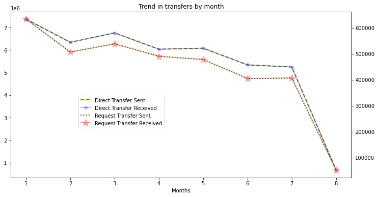
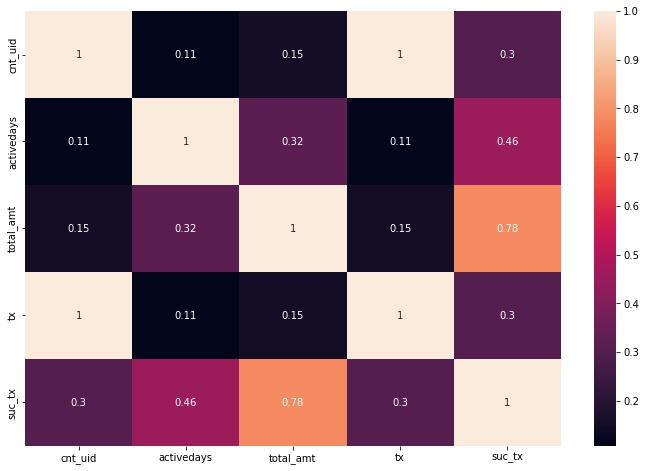
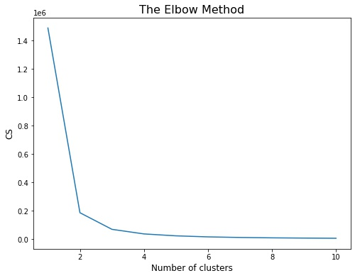
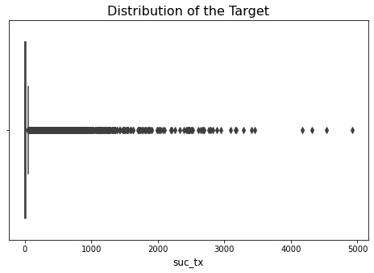
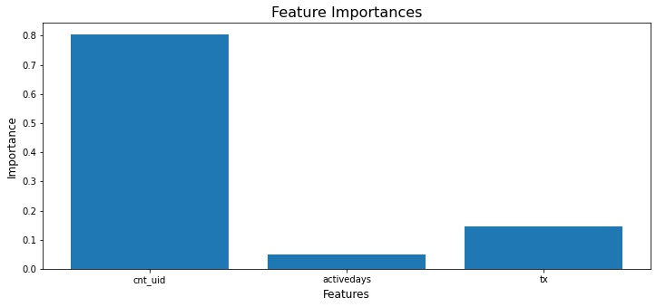

The ever-dynamic Asian telecommunication industry is facing stiff competition amongst
service providers with rapid introduction of innovative features and services such as airtime
transfer, data sharing, mobile money, location aware apps, advanced social networking, and
several OTT services. Fast growing telecom market in developing Asian countries is primarily
a prepaid connections market. Among the various ways to reload a prepaid mobile phone
through a refill card, online bank transfer, electronic reload at convenient store etc. peer to
peer airtime transfer is emerging as a popular option. Peer to peer transfer involves a
subscriber A transfer a part of their balance to subscriber B which can then be used for data,
SMS, or voice call.

## Challenge
The airtime transfer can be done in two ways: direct transfer and accepting a request for a
transfer. Direct transfer involves a subscriber A initiating a transfer directly to subscriber B.
Request transfer involves subscriber B raising a request for a certain amount from subscriber
A and then subscriber A either accepts or rejects the transfer request. Typically, the transfer is
done through an SMS in a specific format to a toll-free number. Many a times the transfer
fails for variety of reasons such as incorrect amount (Only integer amount of $1 - $25 is
allowed), incorrect mobile number, sending airtime to a post postpaid number, technical
glitches etc. **The objective of this data challenge is to characterize the users and identify
the drivers of airtime transfer to enhance the count and value of successful transactions.**

### [[Show me the Code]](https://github.com/vedantthapa/Project-Niagara-Solution)

---

Let's start by dividing the columns into meta data (transactions) and customer data to avoid confusion.


```python
cust_df = pd.DataFrame()
cust_df['uid'] = df.uid
cust_df['cnt_uid'] = df.cnt_uid
cust_df['activedays'] = df.activedays
cust_df['total_amt'] = df.total_amount
```


```python
transaction_cols = [i for i in df.columns if 'mn' in i]
transactions_df = df.loc[:, ['uid'] + transaction_cols[8:]]
```

Also, since the data was collected in a real-time environment, there are a few cases where there are inconsistencies in the columns like `tx` and `success` which indicate the total number of transactions and total number of successful transactions respectively. Therefore, these columns are re-calculated from the rest of the data provided

*Note: This information was verified by the moderator of the competition.*


```python
cust_df['tx'] = transactions_df.iloc[:,1:9].sum(axis=1)
cust_df['suc_tx'] = transactions_df.iloc[:,17:].sum(axis=1)
```

We start by investigating the transaction data, firstly let's check whether there are any users who don't have a single successful transaction


```python
cust_df[cust_df.suc_tx == 0].shape[0] / cust_df.shape[0]
```
    0.37119894148277777

Interestingly, 37% users don't even have a single successful transaction

Since, the customer-level transaction data is given for a period of 8 months, it would be interesting to see the month-wise trend in the data. This calculation is a bit complex and involves grouping and slicing operations.

Here's a look at the table

<div>
<style scoped>
    .dataframe tbody tr th:only-of-type {
        vertical-align: middle;
    }

    .dataframe tbody tr th {
        vertical-align: top;
    }

    .dataframe thead th {
        text-align: right;
    }
</style>
<table border="1" class="dataframe">
  <thead>
    <tr style="text-align: right;">
      <th>tx_type</th>
      <th>ra</th>
      <th>rb</th>
      <th>ta</th>
      <th>tb</th>
    </tr>
    <tr>
      <th>month</th>
      <th></th>
      <th></th>
      <th></th>
      <th></th>
    </tr>
  </thead>
  <tbody>
    <tr>
      <th>1</th>
      <td>634246</td>
      <td>634246</td>
      <td>7372594</td>
      <td>7373422</td>
    </tr>
    <tr>
      <th>2</th>
      <td>507185</td>
      <td>507184</td>
      <td>6342612</td>
      <td>6343615</td>
    </tr>
    <tr>
      <th>3</th>
      <td>538862</td>
      <td>538862</td>
      <td>6759832</td>
      <td>6760975</td>
    </tr>
    <tr>
      <th>4</th>
      <td>490808</td>
      <td>490807</td>
      <td>6034889</td>
      <td>6035866</td>
    </tr>
    <tr>
      <th>5</th>
      <td>478420</td>
      <td>478418</td>
      <td>6081518</td>
      <td>6082517</td>
    </tr>
    <tr>
      <th>6</th>
      <td>405210</td>
      <td>405210</td>
      <td>5340496</td>
      <td>5341387</td>
    </tr>
    <tr>
      <th>7</th>
      <td>406012</td>
      <td>407809</td>
      <td>5246627</td>
      <td>5248129</td>
    </tr>
    <tr>
      <th>8</th>
      <td>52292</td>
      <td>52528</td>
      <td>673933</td>
      <td>674155</td>
    </tr>
  </tbody>
</table>
</div>

Now for the trend
    


Overall there is a decreasing trend in the number of transactions across months

Previously created table would also help us determine what proportion of transactions are successful

```python
total_tx = transactions_df.iloc[:,1:9].sum()
tx_mn.suc_tx.sum() / total_tx.sum()
```

    0.2586547689367111

On average, only 1 in 4 transaction is successful.

Let's also have a look at the proportion of direct and request transfers in our dataset

    array([0.9258175, 0.0741825])

Here the values denote number of direct and request transfers respectively. Large proportion of customers prefer direct transfers over request transfers

Now that we understand the customer transactions better, let's have a look at the customer table and analyze if there's any relationship between the variables. More specifically we're aiming to see if any linear relationship exists among the columns.
    

    

```python
pearsonr(cust_df.suc_tx, cust_df.total_amt)
```

    (0.7827031132599644, 0.0)

- The above values indicate the correlation between successful transactions and the total amount transferred for a particular customer, and its corresponding p-value respectively. The values indicate that there is a significantly strong positive correlation between these columns.

- Also, from the heatmap it can be observed that majority of the transactions involve new people as `cnt_uid` column has a positive correlation with the total number of transactions.

Let's characterize the users using clustering. More specifically using KMeans clustering methodology. It is crucial to normalize the columns during preprocessing due to different scales, as KMeans is a distance-based algorithm


```python
scaler = preprocessing.MinMaxScaler()
scaled_arr = scaler.fit_transform(cust_df)

scaled_arr.shape
```

    (9371600, 6)

We use elbow-plot to determine the optimal number of clusters for KMeans
    


We observe from the above plot that 3 would be the optimal number of clusters for our case.

Fitting the algorithm...

    KMeans(n_clusters=3, random_state=42)

Here's a look at the clusters and its characterics for different columns


<div>
<style scoped>
    .dataframe tbody tr th:only-of-type {
        vertical-align: middle;
    }

    .dataframe tbody tr th {
        vertical-align: top;
    }

    .dataframe thead th {
        text-align: right;
    }
</style>
<table border="1" class="dataframe">
  <thead>
    <tr style="text-align: right;">
      <th></th>
      <th>cnt_uid</th>
      <th>activedays</th>
      <th>total_amt</th>
      <th>tx</th>
      <th>suc_tx</th>
    </tr>
    <tr>
      <th>cluster</th>
      <th></th>
      <th></th>
      <th></th>
      <th></th>
      <th></th>
    </tr>
  </thead>
  <tbody>
    <tr>
      <th>0</th>
      <td>4.327881</td>
      <td>7.333546</td>
      <td>6.427707</td>
      <td>4.325501</td>
      <td>1.112377</td>
    </tr>
    <tr>
      <th>1</th>
      <td>92.512831</td>
      <td>193.516409</td>
      <td>55.570050</td>
      <td>91.677877</td>
      <td>23.953850</td>
    </tr>
    <tr>
      <th>2</th>
      <td>25.305886</td>
      <td>96.190044</td>
      <td>20.740651</td>
      <td>25.179140</td>
      <td>6.021600</td>
    </tr>
  </tbody>
</table>
</div>


The clusters are quite different from each other with respect to the mean value of the features. However let's check if these differences are significant using ANOVA

    Col = cnt_uid
                       df        sum_sq       mean_sq             F  PR(>F)
    C(cluster)        2.0  1.522260e+10  7.611302e+09  47570.489501     0.0
    Residual    9371597.0  1.499460e+12  1.600005e+05           NaN     NaN
    
       group1  group2       Diff      Lower      Upper     q-value  p-value
    0       2       0  20.978005  20.110581  21.845429   80.158685    0.001
    1       2       1  67.206945  66.303296  68.110595  246.508642    0.001
    2       0       1  88.184951  87.506381  88.863520  430.742777    0.001
    
    
    Col = activedays 
                       df        sum_sq       mean_sq             F  PR(>F)
    C(cluster)        2.0  6.626394e+10  3.313197e+10  9.790829e+07     0.0
    Residual    9371597.0  3.171330e+09  3.383980e+02           NaN     NaN
    
       group1  group2        Diff       Lower       Upper       q-value  p-value
    0       2       0   88.856498   88.816606   88.896390   7382.821651    0.001
    1       2       1   97.326366   97.284808   97.367923   7762.387032    0.001
    2       0       1  186.182864  186.151657  186.214070  19774.705623    0.001
    
    
    Col = total_amt
                       df        sum_sq       mean_sq              F  PR(>F)
    C(cluster)        2.0  4.670997e+09  2.335498e+09  472249.958543     0.0
    Residual    9371597.0  4.634696e+10  4.945471e+03            NaN     NaN
    
       group1  group2       Diff      Lower      Upper      q-value  p-value
    0       2       0  14.312944  14.160442  14.465445   311.080081    0.001
    1       2       1  34.829399  34.670529  34.988270   726.642547    0.001
    2       0       1  49.142343  49.023044  49.261642  1365.325600    0.001
    
    
    Col = tx
                       df        sum_sq       mean_sq             F  PR(>F)
    C(cluster)        2.0  1.493326e+10  7.466632e+09  46680.592349     0.0
    Residual    9371597.0  1.499001e+12  1.599515e+05           NaN     NaN
    
       group1  group2       Diff      Lower      Upper     q-value  p-value
    0       2       0  20.853640  19.986348  21.720931   79.695670    0.001
    1       2       1  66.498737  65.595226  67.402248  243.948337    0.001
    2       0       1  87.352376  86.673911  88.030842  426.741347    0.001
    
    
    Col = suc_tx
                       df        sum_sq       mean_sq             F  PR(>F)
    C(cluster)        2.0  1.027724e+09  5.138621e+08  1.059767e+06     0.0
    Residual    9371597.0  4.544122e+09  4.848823e+02           NaN     NaN
    
       group1  group2       Diff      Lower      Upper      q-value  p-value
    0       2       0   4.909222   4.861471   4.956974   340.754495    0.001
    1       2       1  17.932250  17.882504  17.981996  1194.800167    0.001
    2       0       1  22.841473  22.804117  22.878828  2026.703045    0.001
    
    


The above table shows the signifance of the difference between clusters for various columns and also shows which clusters are different from each other using Tukey's HSD Test.

Let's move on to the second part of the problem where we determine the factors that affect the count and value of a successful transaction. 

We have already identified that count and value of a successful transaction are correlated therefore we exclude `total_amt` column from the analysis and build a model on the following features to study its effect on the target (num of successful transactions):
- `cnt_uid`
- `activedays`
- `tx`

In order to study the effect of different features on the number of successful transactions, a transaction first has to be successful. Therefore we'll subset the dataframe to include only those transactions which were successful.


```python
suc_tx = cust_df[cust_df.suc_tx > 0]
```

Let's plot the distribution of our target.
    


The target seems to be heavily skewed and there are a lot of outliers in the data. However, upon investigation it was found that these outliers were actual data points and not errors therefore it doesn't make sense to exlcude them from the analysis.

Moreover, since the data is not normally distributed and due to lack of linear relationships between the target and the independant variables, we'll employ a tree based model.

Let's split the dataset into training and testing sets. Due to a huge amount of data and limited time, we'l only split the dataset into a train and test set.


```python
x_train, x_test, y_train, y_test = model_selection.train_test_split(x, y, test_size=0.30, random_state=42)
```

Now, training our Decision Tree Regressor

    DecisionTreeRegressor(max_depth=7, random_state=49)

Here's look at the feature importances
    

    


Interestingly, the number of distinct persons with whom a customer has engaged is ranked highest, while the number of days a it has been active on the network is ranked lowest.

---

## Conclusion

- Cluster 1 was identified as a persona with the high value and more distinct transactions. This persona also interacts with new people more.
- Cluster 2 consists of moderately engaged customers, an important goal for the business here would be to try to move these users into Cluster 1 by leveraging marketing efforts.
- My first suggestion in order to drive the count and value of a successful transactions would be to improve the quality of the data by adding in features that determines the major reason behind an unsuccesful transaction.
- Furthermore, as seen above, the value of a transaction has a strong positive correlation with the count, implying that enhancing one can boost the other.
- Encouraging a customer to make more unique transactions will help boost the number of successful transactions, therefore enhancing the value of a transaction.
